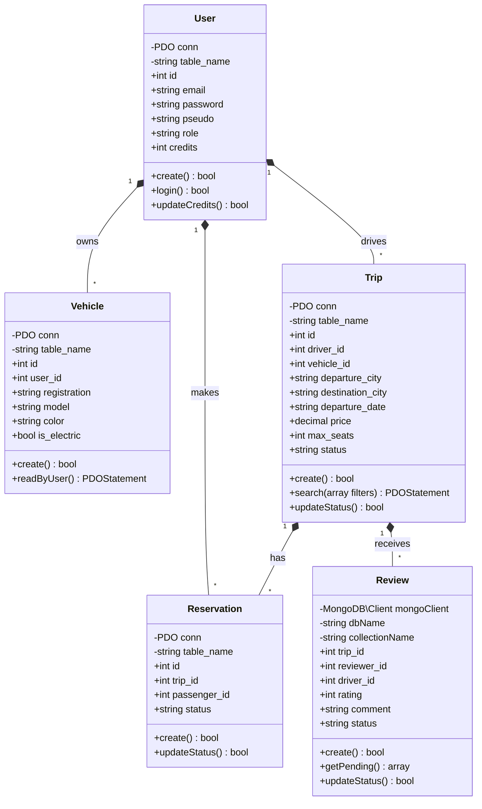

# Diagramme de Classes - EcoRide

Le projet suit une architecture Backend "API-Centric" en PHP (Programmation Orientée Objet). Ce diagramme illustre les principales classes modèles.

```mermaid
classDiagram
    class User {
        -PDO conn
        -string table_name
        +int id
        +string email
        +string password
        +string pseudo
        +string role
        +int credits
        +create() bool
        +login() bool
        +updateCredits() bool
    }

    class Vehicle {
        -PDO conn
        -string table_name
        +int id
        +int user_id
        +string registration
        +string model
        +string color
        +bool is_electric
        +create() bool
        +readByUser() PDOStatement
    }

    class Trip {
        -PDO conn
        -string table_name
        +int id
        +int driver_id
        +int vehicle_id
        +string departure_city
        +string destination_city
        +string departure_date
        +decimal price
        +int max_seats
        +string status
        +create() bool
        +search(array filters) PDOStatement
        +updateStatus() bool
    }

    class Reservation {
        -PDO conn
        -string table_name
        +int id
        +int trip_id
        +int passenger_id
        +string status
        +create() bool
        +updateStatus() bool
    }

    class Review {
        -MongoDB\Client mongoClient
        -string dbName
        -string collectionName
        +int trip_id
        +int reviewer_id
        +int driver_id
        +int rating
        +string comment
        +string status
        +create() bool
        +getPending() array
        +updateStatus() bool
    }

    User "1" *-- "*" Vehicle : owns
    User "1" *-- "*" Trip : drives
    User "1" *-- "*" Reservation : makes
    Trip "1" *-- "*" Reservation : has
    Trip "1" *-- "*" Review : receives
```
