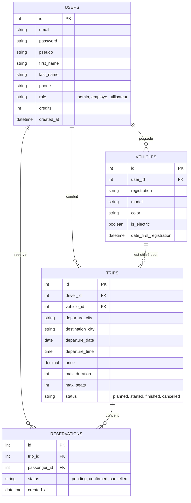
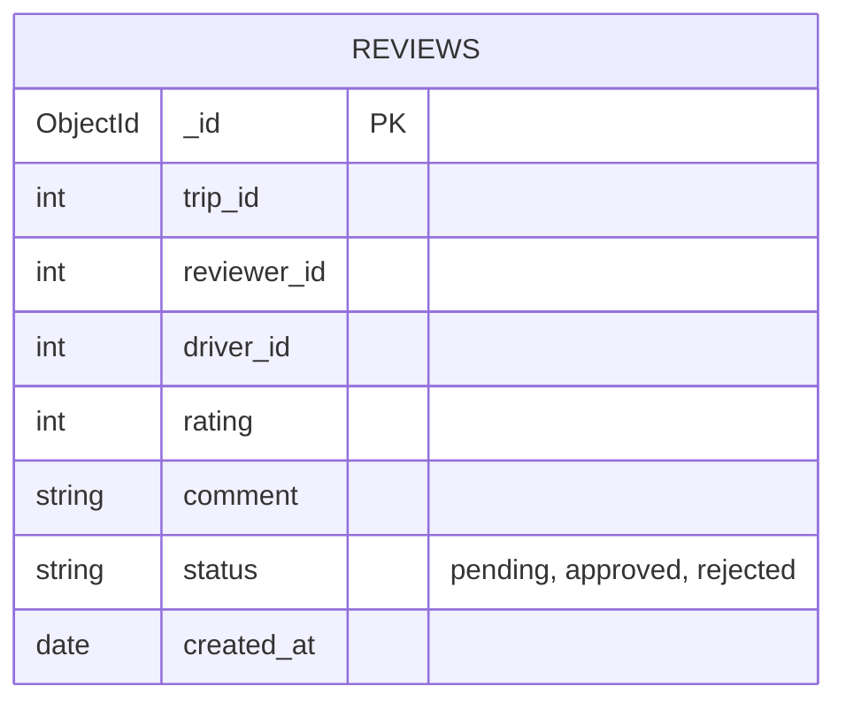

# Modèle Conceptuel de Données (MCD) - EcoRide

Ce document présente la structure de la base de données relationnelle et non-relationnelle d'EcoRide.

## Base de données Relationnelle (MySQL / MariaDB)

## Base de données Non-relationnelle (MongoDB)

