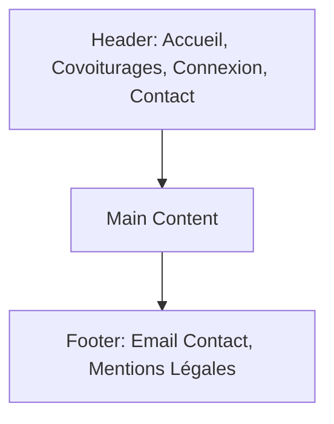

# Wireframes & Structure - EcoRide

Ce document présente l'arborescence et les zones fonctionnelles des composants.

## 🧱 Structure des Composants fixes

## 📐 Layouts

### Page d'Accueil
- **Zone 1** : Hero Section (Tagline + Image Impact)
- **Zone 2** : Barre de recherche flottante (Centrale)
- **Zone 3** : Arguments écologiques (3 Colonnes)
- **Zone 4** : Témoignages / Preuve sociale

### Liste des Résultats
- **Zone 1** : Barre latérale de filtres (Largeur 25%)
- **Zone 2** : Grid de cartes de trajets (Largeur 75%)
    - Badge "ECO-VOYAGE" en haut à droite de la card.
    - Avatar chauffeur en haut à gauche.

### Espace Utilisateur
- **Zone 1** : Sommaire du compte (Points/Crédits)
- **Zone 2** : Profil & Véhicules
- **Zone 3** : Actions en cours (Start/Stop trip)
